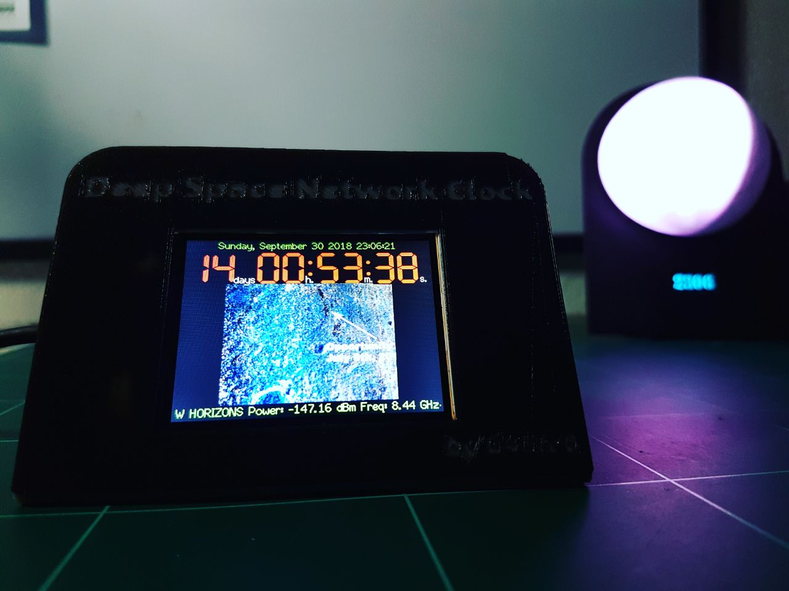
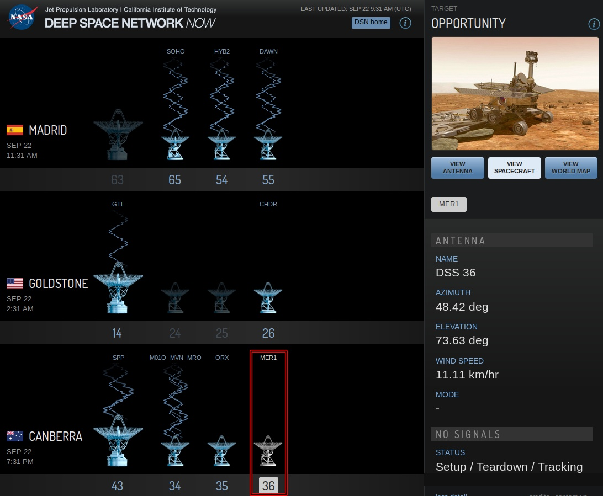
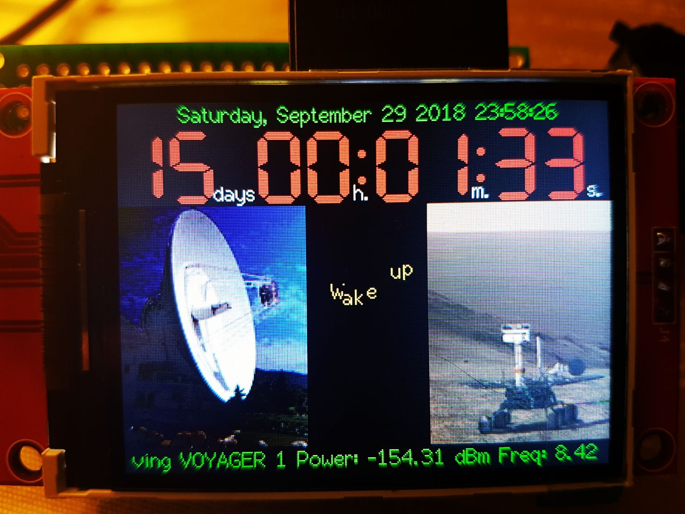

# DeepSpaceNetworkClock
NASA / JPL (DSN) Deep Space Clock, currently focus on the fate of the Opportunity rover, great for space lover.
<h1 lang="en-US" class="western">Deep Space Network Clock</h1>

 

 

 

 

 

 

 

 

 

 

 

 

 

 

At the
beginning of June, due the great dust storm contact with Rover
Opportunity was lost.

The
rover uses solar panels to provide power and to recharge its
batteries  and the dust storm is blocking the sunlight . 

 

It is
expected that Opportunity has experienced a low-power fault, and go
into hibernation.

 

The
storm was one of several that stirred up enough dust to enshroud most
of the Red Planet, and  beggin to dissipate the end of August, since
then the NASA antennas point to the Rover several times a day waiting
for an Opportunity’s answer.

 

<b>Are
you worried about the rover Opportunity fate?</b>

<b>Would
you like to be the first to know that Rover Opportunity is
operational?</b>

 

If so,
this project will surely interest you :)

 

 

With an
ESP32 microcontroller we connect in realtime to the NASA Deep Space
Network (DSN), checking if they are trying to establish a
communication with the Rover Opportunity.

 

The
clock shows the current time, the time left for NASA to finish the
mission, and the information about the probes that are received at
that moment.

 

If any
of the DSN antennas are pointing to the rover, the following
animation, with reverse sinusoidal scroll will be displayed:

 

 

 

 

 

 

 

 

 

 

 

 

 

 

 

 

 

 

 

 

 

 

 

 

When
there are no antennas actively listening the Oppy rover, photos of
the mission will be displayed.

 

 

 

 

 

 

 

 

 

 

 

 

 

 

 

 

 

 

 

 

 

 

 

 

 

 

 

 

 

 

 

 

 

 

 

 

If we
receive signal from tOppy an alarm will be activated, to announce the
good news, and will play and MP3 stored on the SDCARD.

 

 

 

 

 

 

Pictures
Credit : NASA /JPL and Oppy render <a href="https://twitter.com/_TheSeaning">Seán
Doran</a>

 

